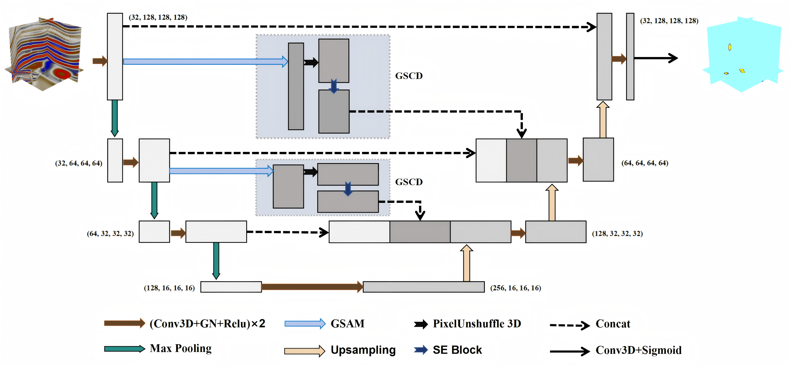
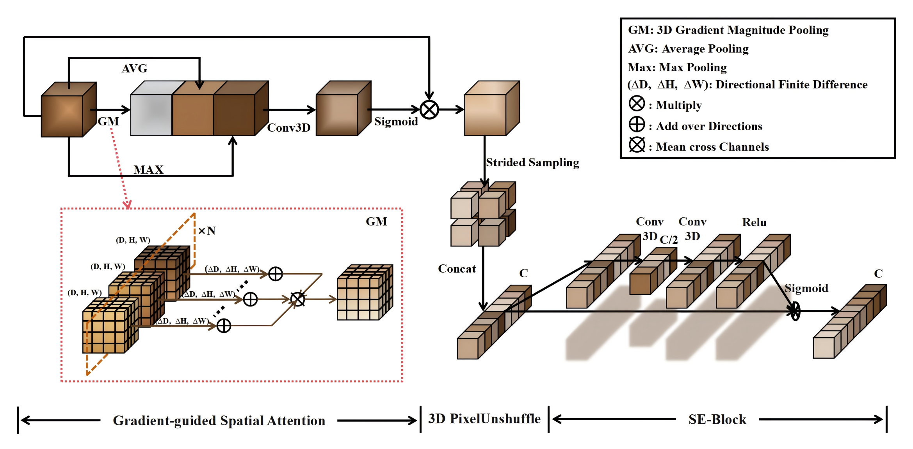
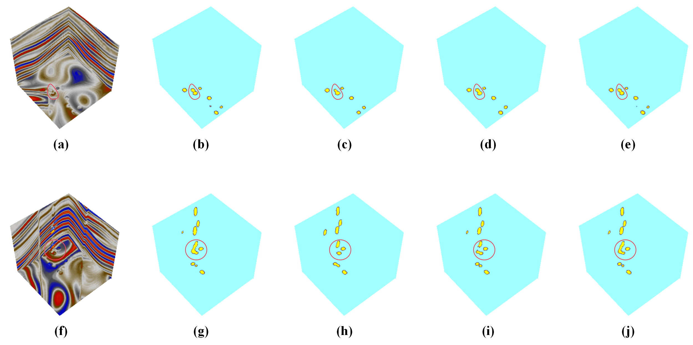

# GSCD-Unet: 3D Paleokarst Cave Segmentation

PyTorch implementation accompanying the submitted manuscript **"3-D Seismic
Detection of Paleokarst Cave Using Neural Networks with Efficient Edge-aware
Downsampling and Composite Loss."**

The project performs voxel-wise semantic segmentation of paleokarst caves in
3D seismic data. Its main model, **GSCD-Unet**, combines a compact 3D U-Net with
gradient-guided spatial attention, information-preserving 3D PixelUnshuffle,
SE channel reweighting, and a morphology-aware composite loss.



## Main contributions

- **GSCD module:** Gradient-guided Spatial Attention and Channel-shuffle
  Downsampling preserves high-resolution boundary information in skip paths.
- **3D PixelUnshuffle:** rearranges spatial voxels into channels without
  discarding the original feature values.
- **Composite loss:** Focal Loss + Boundary-aware Weighted BCE + Gradient
  Consistency Loss addresses class imbalance, boundary quality and 3D
  structural continuity.
- **End-to-end workflow:** synthetic data construction, training, quantitative
  testing, interactive visualization, and block-wise inference on SEG-Y or DAT
  field volumes.



## results

We use 200 synthetic `256 x 256 x 256` seismic/label pairs, split
8:1:1 into training, validation and test sets. Models use `128 x 128 x 128`
crops, batch size 1, Adam with learning rate `1e-4`, and 100 epochs on an
NVIDIA GeForce RTX 4090.

| Model | Parameters | Accuracy | Precision | Recall | Dice | IoU |
|---|---:|---:|---:|---:|---:|---:|
| 3D U-Net | 8.90M | 0.9991 | 0.8052 | 0.9026 | 0.8511 | 0.7408 |
| UCTransNet | 120.69M | 0.9997 | **0.9850** | 0.8847 | 0.9322 | 0.8730 |
| GSCD-Unet + Focal | 7.98M | 0.9997 | 0.9259 | 0.9596 | 0.9424 | 0.8911 |
| **GSCD-Unet + Composite Loss** | **7.98M** | **0.9998** | 0.9486 | **0.9691** | **0.9587** | **0.9208** |

Compared with 3D U-Net, the reported Dice and IoU increase by **10.76** and
**18.00 percentage points**, respectively.



In each row, the panels show the seismic input, ground truth, U-Net prediction,
UCTransNet prediction and GSCD-Unet prediction from left to right.

The field demonstration applies GSCD-Unet to the W5 well area in the Shunbei
region of the Tarim Basin and qualitatively compares predicted cave locations
with drilling circulation-loss observations.

## Repository structure

```text
.
├── ConstructData/          # Synthetic data generation and inspection
├── Data/                   # Local data layout; binary data are ignored
├── Models/                 # GSCD-Unet, baselines and experimental variants
├── Pictures/               # Visualization notes and generated intermediates
├── Utils/                  # Dataset, losses and transformer configuration
├── train.py                # Training entry point
├── test.py                 # Synthetic test-set metrics and ROC
├── Test_Reality_All.py     # Block-wise field-volume inference
└── Test_Vision_Version.py  # Interactive prediction visualization
```

## Installation

Python 3.9 or newer is required. A CUDA-enabled PyTorch build is strongly
recommended because the models process 3D crops.

```bash
conda create -n gscdunet python=3.10
conda activate gscdunet

# Install a PyTorch build matching your CUDA version first:
# https://pytorch.org/get-started/locally/
pip install -r requirements.txt
```

For SEG-Y input and interactive 3D visualization:

```bash
pip install -r requirements-optional.txt
```

## Data preparation

Generate three samples for a training smoke run:

```bash
python ConstructData/CreateProcess.py --num-data 3 --seed 12345
```

Generate the complete manuscript split:

```bash
python ConstructData/CreateProcess.py --num-data 200 --seed 12345
```

The default output is:

```text
Data/GroundTruth/synthetic_seismic_final_<id>.dat
Data/Label/synthetic_seismic_final_<id>.dat
```

Each file contains a headerless `float32` array in C order. Use
`--save-intermediate-dat` to additionally save the seven generation stages.
See [Data/README.md](Data/README.md) for size and field-data notes.

## Training

Train the paper model and composite loss:

```bash
python train.py \
  --model GSCDUnet \
  --loss CompositeLoss \
  --data-root Data \
  --output-dir runs \
  --seed 12345
```

The manuscript split is fixed to:

- training: IDs 1-160;
- validation: IDs 161-180;
- test: IDs 181-200.

For a one-epoch pipeline check using IDs 1-3:

```bash
python train.py --debug
```

Checkpoints, text logs and loss curves are written under
`runs/<model>_<loss>/`. Resume a checkpoint with `--resume <path>`.

## Synthetic-data evaluation

```bash
python test.py \
  --model GSCDUnet \
  --checkpoint runs/GSCDUnet_CompositeLoss/check/checkpoint_best_GSCDUnet_CompositeLoss.pth \
  --data-root Data \
  --test-data-ids 181 182 183 184 185 186 187 188 189 190 191 192 193 194 195 196 197 198 199 200
```

`test.py` accumulates the confusion matrix and an approximate histogram ROC
without retaining all voxel probabilities in memory. It reports Accuracy,
Precision, Recall, F1/Dice, IoU, mIoU and approximate AUC.

## Visualization

Inspect a generated data/label pair:

```bash
python ConstructData/check_Visualization.py --start-index 181 --end-index 182
```

Visualize a prediction:

```bash
python Test_Vision_Version.py \
  --model GSCDUnet \
  --checkpoint <checkpoint.pth> \
  --data-root Data \
  --test-data-ids 181
```

These commands require `cigvis` and an environment capable of interactive 3D
rendering.

## Field-volume inference

For a SEG-Y cube:

```bash
python Test_Reality_All.py \
  --models GSCDUnet \
  --checkpoints <checkpoint.pth> \
  --data-path <field-volume.segy> \
  --input-format segy \
  --dim 582 608 1039 \
  --block-size 128 128 128 \
  --output-dir reality_results
```

For a raw DAT cube, select `--input-format dat` and provide the exact source
shape with `--dim`. Predictions are written directly to disk-backed `float32`
arrays so multiple full output volumes are not held in RAM. SEG-Y loading still
materializes the input cube and therefore requires sufficient host memory.

## Model names and compatibility

| CLI name | Role |
|---|---|
| `GSCDUnet` | Final paper model; recommended default |
| `UPPA3` | Legacy name for the same architecture and checkpoint layout |
| `UNet`, `UnetPlusPlus`, `UCTransNet` | Comparison baselines |
| `CWnet`, `CSWnet`, `UPPA`, `UPPA1`, `UPPA2` | Retained experimental variants |

Likewise, `CompositeLoss` is the public loss name and `newloss` remains a legacy
CLI alias. `GSCD` is the public module name and `SSS` remains a Python alias for
older code.

## Reproducibility and limitations

Run the local smoke suite with:

```bash
python -m unittest discover -s tests -v
```

The suite checks the published model shape and 7.98M parameter count, composite
loss, legacy checkpoint compatibility, convolutional baseline output shapes,
memory-mapped data loading, and deterministic synthetic generation.

## Citation

The accompanying manuscript is currently submitted. Until a final bibliographic
record is available, cite it as:

```bibtex
@unpublished{hu2025gscdunet,
  title  = {3-D Seismic Detection of Paleokarst Cave Using Neural Networks with Efficient Edge-aware Downsampling and Composite Loss},
  author = {Hu, Haowen and Dong, Xiaobin and Jiang, Shu and Song, Xiaohu},
  year   = {2025},
  note   = {Submitted manuscript}
}
```

The transformer baseline is adapted from
[UCTransNet](https://github.com/McGregorWwww/UCTransNet). See
[THIRD_PARTY.md](THIRD_PARTY.md) for provenance and redistribution notes.

## License

Original project code is released under the [MIT License](LICENSE). Third-party
derived portions remain subject to their original copyright and applicable
terms.
